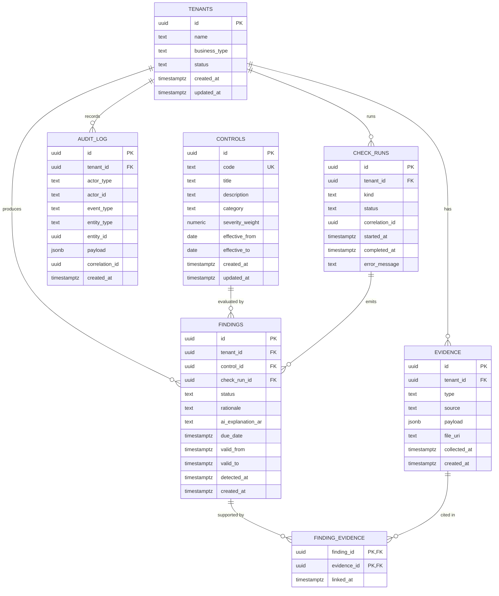

# Data Model — MVP Schema (Phase 1)

- **Status:** Accepted, 2026-06-11
- **Related:** [ADR-0001 Database choice](adr/0001-database-choice.md) · [ADR-0002 Findings history model](adr/0002-findings-history-model.md) · [ADR-0003 Audit-log immutability](adr/0003-audit-log-immutability.md)

## Scope

The first relational schema for PDPL Autopilot. It covers the entities required for the MVP scope in `docs/product-definition.md`:

- An initial readiness questionnaire → gap report + readiness score.
- Continuous (scheduled) checks + alerts.
- Reading uploaded documents (privacy policy) and recording what was extracted.
- Per-gap Arabic explanation, after deterministic verification.

Three things this schema explicitly does **not** address yet — each is deferred to a later ADR:

- **Authentication / users.** Per ADR-0001, auth design is deferred. There is no `users` table here. Audit log records an `actor_id` as a free-text string so the eventual users table can be joined when it exists.
- **Erasure / right to be forgotten.** PDPL grants a data-subject erasure right. Designing it requires decisions about object storage (Supabase Storage vs S3), about audit-log redaction semantics (see [ADR-0003](adr/0003-audit-log-immutability.md)), and about cascading effects on findings. Until that ADR exists, evidence is **hard-deleted** in development; no `deleted_at` column is added yet to avoid baking in a half-design.
- **Row-Level Security (RLS).** Per ADR-0001, tenant isolation is enforced via `tenant_id` columns plus query-layer guards in this phase. RLS will follow.

## Entity-Relationship Diagram

## Entities

### `tenants`

The customer (a small Saudi business). Soft-deletes via `status`; never hard-deleted while audit history exists.

| Column | Type | Notes |
|---|---|---|
| `id` | `uuid` PK | App-generated UUID v7. |
| `name` | `text NOT NULL` | `CHECK length(name) > 0` |
| `business_type` | `text NOT NULL` | `CHECK IN ('ecommerce','clinic','saas','other')`. Drives eval-set bucketing. |
| `status` | `text NOT NULL DEFAULT 'active'` | `CHECK IN ('active','suspended','cancelled')`. |
| `created_at`, `updated_at` | `timestamptz NOT NULL` | `DEFAULT now()`. App sets `updated_at` on mutation. |

### `controls`

A single PDPL obligation. Global, not per-tenant. Versioned over time via `effective_from` / `effective_to` so we never silently lose history when SDAIA amends the regulation.

| Column | Type | Notes |
|---|---|---|
| `id` | `uuid` PK | |
| `code` | `text NOT NULL UNIQUE` | e.g. `PDPL-ART4-CONSENT`. `CHECK code LIKE 'PDPL-%'`. |
| `title_en` | `text NOT NULL` | Short human label (English). Added by migration 0003 as a rename of the original `title` column. |
| `title_ar` | `text NOT NULL` | Short human label (Arabic). Added by migration 0003. |
| `description_en` | `text NOT NULL` | The obligation in plain language (English). Rename of the original `description`. |
| `description_ar` | `text NOT NULL` | The obligation in plain language (Arabic). Added by migration 0003. |
| `category` | `text NOT NULL` | e.g. `consent`, `breach_notification`, `data_subject_rights`. Free-text now; may become an enum once the catalogue is stable. |
| `severity_weight` | `numeric(4,2) NOT NULL` | `CHECK > 0 AND <= 10`. Used by the deterministic scoring step. |
| `effective_from` | `date NOT NULL` | When this obligation began applying. |
| `effective_to` | `date` | Null = currently in force. `CHECK (effective_to IS NULL OR effective_to > effective_from)`. |
| `created_at`, `updated_at` | `timestamptz NOT NULL` | |

> **Two-language design (noted decision, not an ADR).** Two TEXT columns per language, not a JSONB `i18n` blob. Justification: the MVP serves Arabic + English only, queries hit these fields directly, and an explicit column survives `EXPLAIN` and constraint checks better than a JSONB key lookup. If a third language ever lands, revisit — JSONB or a `control_translations` table becomes proportional then. Not now.

> **Amendment pattern.** If SDAIA amends a control, we close the existing row (`effective_to = <amendment date>`) and `INSERT` a new row with a new `code` (e.g. `-v2` suffix) or — if the substance is unchanged but the text differs — keep the same `code` and rely on the date range. The first amendment will force this decision; we are leaving it open rather than guessing.

### `evidence`

The raw substrate that feeds findings: a questionnaire answer, an uploaded document, the output of a scheduled check, a manual attestation. Evidence is per-tenant; many evidence rows can support one finding, and one evidence row can support many findings (see `finding_evidence`).

| Column | Type | Notes |
|---|---|---|
| `id` | `uuid` PK | |
| `tenant_id` | `uuid NOT NULL` | `REFERENCES tenants(id) ON DELETE CASCADE`. (Tenant cannot in fact be deleted while audit history references it; see audit_log.) |
| `type` | `text NOT NULL` | `CHECK IN ('questionnaire_answer','document_upload','scheduled_check_result','manual_attestation')`. |
| `source` | `text NOT NULL` | Free-text origin: `'user_upload'`, `'scheduled_check:v1'`, `'questionnaire:initial'`. |
| `payload` | `jsonb NOT NULL DEFAULT '{}'` | Structured contents — the answer, the parsed extract, the check output. |
| `file_uri` | `text` | Null unless `type = 'document_upload'`. `CHECK (type != 'document_upload' OR file_uri IS NOT NULL)`. Points to object storage; not the file itself. |
| `collected_at` | `timestamptz NOT NULL` | When the evidence was observed (not when it was inserted). |
| `created_at` | `timestamptz NOT NULL DEFAULT now()` | |

### `check_runs`

Every deterministic check — initial questionnaire, a scheduled sweep, a manual rerun — gets a `check_run`. Findings reference the run that emitted them, so "why did this finding change?" is always answerable: *that* run, with *that* code version, at *that* moment.

| Column | Type | Notes |
|---|---|---|
| `id` | `uuid` PK | |
| `tenant_id` | `uuid NOT NULL` | `REFERENCES tenants(id) ON DELETE CASCADE`. |
| `kind` | `text NOT NULL` | `CHECK IN ('initial_questionnaire','scheduled','manual')`. |
| `status` | `text NOT NULL DEFAULT 'running'` | `CHECK IN ('running','completed','failed')`. |
| `correlation_id` | `uuid` | Request correlation ID — links the run to log lines and to audit events. |
| `started_at` | `timestamptz NOT NULL DEFAULT now()` | |
| `completed_at` | `timestamptz` | `CHECK (completed_at IS NULL OR completed_at >= started_at)` and `CHECK (status != 'completed' OR completed_at IS NOT NULL)`. |
| `error_message` | `text` | Populated on `status = 'failed'`. |

### `findings`

The per-tenant × per-control verdict, modeled as **SCD Type 2** per [ADR-0002](adr/0002-findings-history-model.md): every status transition is a new row, the prior row's `valid_to` is set to `now()`, and the "current" set is `WHERE valid_to IS NULL`.

| Column | Type | Notes |
|---|---|---|
| `id` | `uuid` PK | |
| `tenant_id` | `uuid NOT NULL` | `REFERENCES tenants(id) ON DELETE CASCADE`. |
| `control_id` | `uuid NOT NULL` | `REFERENCES controls(id) ON DELETE RESTRICT` — a control cannot be deleted while findings reference it. |
| `check_run_id` | `uuid NOT NULL` | `REFERENCES check_runs(id) ON DELETE RESTRICT` — runs are not deleted. |
| `status` | `text NOT NULL` | `CHECK IN ('compliant','partial','non_compliant','not_applicable','unknown','not_assessed')`. `'not_assessed'` is the baseline value emitted by the first check run before any evidence exists — semantically distinct from `'unknown'`, which is reserved for *"the deterministic engine ran and could not decide"* (see deferred ADR on the status decision engine). Added in migration 0003 as an additive `CHECK` change. |
| `rationale` | `text NOT NULL` | The deterministic explanation — *what made this status what it is*. Never AI-generated. |
| `ai_explanation_ar` | `text` | Nullable. Arabic prose explanation generated by the AI layer **after** deterministic verification (per the core decision principle in `CLAUDE.md`). |
| `due_date` | `timestamptz` | Nullable remediation deadline. PDPL's 72-hour breach-notification window lands here for breach findings. |
| `valid_from` | `timestamptz NOT NULL DEFAULT now()` | When this state became current. |
| `valid_to` | `timestamptz` | Null while this is the current state. `CHECK (valid_to IS NULL OR valid_to > valid_from)`. |
| `detected_at` | `timestamptz NOT NULL DEFAULT now()` | The moment the producing check observed this state — typically equal to `valid_from`, but kept distinct because a delayed write should not lie about *when* the state was observed. |
| `created_at` | `timestamptz NOT NULL DEFAULT now()` | |

### `finding_evidence`

The many-to-many join between findings and evidence. A single uploaded privacy policy can support multiple findings; a single finding can be supported by multiple evidence rows (questionnaire + document + check result).

| Column | Type | Notes |
|---|---|---|
| `finding_id` | `uuid NOT NULL` | `REFERENCES findings(id) ON DELETE CASCADE`. |
| `evidence_id` | `uuid NOT NULL` | `REFERENCES evidence(id) ON DELETE CASCADE`. |
| `linked_at` | `timestamptz NOT NULL DEFAULT now()` | |
| | | `PRIMARY KEY (finding_id, evidence_id)`. |

### `audit_log`

Append-only by DB-layer enforcement per [ADR-0003](adr/0003-audit-log-immutability.md). Every check, decision, AI-verification, evidence write, and admin action lands here.

| Column | Type | Notes |
|---|---|---|
| `id` | `uuid` PK | |
| `tenant_id` | `uuid` | Nullable for system-wide events. `REFERENCES tenants(id) ON DELETE RESTRICT` — a tenant cannot be deleted while audit history references it (the intended behaviour). |
| `actor_type` | `text NOT NULL` | `CHECK IN ('user','system','ai_subsystem','migration')`. |
| `actor_id` | `text` | Free-text. UUID string for an eventual user, service name for system, model identifier for AI. Free-text because the `users` table doesn't exist yet. |
| `event_type` | `text NOT NULL` | Dotted name, e.g. `finding.created`, `finding.transitioned`, `evidence.uploaded`, `ai_explanation.verified`, `score.computed`. |
| `entity_type` | `text` | e.g. `finding`, `evidence`, `control`. |
| `entity_id` | `uuid` | The PK of the referenced entity. |
| `payload` | `jsonb NOT NULL DEFAULT '{}'` | Full event detail. Don't normalize — this is the historical record. |
| `correlation_id` | `uuid` | Same correlation ID as the originating request / check_run, for end-to-end tracing. |
| `created_at` | `timestamptz NOT NULL DEFAULT now()` | The only timestamp on this row. There is no `updated_at` — by definition. |

## Invariants the schema enforces

These are not application conventions; they are constraints in the migration. If application code tries to violate one, it gets a DB error.

1. **One current finding per (tenant, control).** `uniq_findings_current` is a `UNIQUE` partial index on `(tenant_id, control_id) WHERE valid_to IS NULL`.
2. **Closed finding intervals must move forward.** `CHECK (valid_to IS NULL OR valid_to > valid_from)`.
3. **Document evidence must have a file URI.** `CHECK (type != 'document_upload' OR file_uri IS NOT NULL)`.
4. **Controls with an end date must end after they started.** `CHECK (effective_to IS NULL OR effective_to > effective_from)`.
5. **Completed check runs have a completion time.** `CHECK (status != 'completed' OR completed_at IS NOT NULL)` and `CHECK (completed_at IS NULL OR completed_at >= started_at)`.
6. **Tenants with audit history cannot be deleted.** `audit_log.tenant_id REFERENCES tenants ON DELETE RESTRICT`.
7. **`audit_log` is append-only for the application role.** `REVOKE UPDATE, DELETE, TRUNCATE FROM pdpl_app` + `BEFORE TRUNCATE` trigger.

## Indexing strategy

Built around the four query patterns from ADR-0001 plus the change-feed pattern from ADR-0002.

| Pattern | Index |
|---|---|
| **Current gap report** (per tenant) | `UNIQUE INDEX uniq_findings_current ON findings (tenant_id, control_id) WHERE valid_to IS NULL` — also enforces invariant #1. |
| **Deadline range** (open, non-compliant) | `INDEX idx_findings_deadline ON findings (tenant_id, due_date) WHERE valid_to IS NULL AND status != 'compliant' AND due_date IS NOT NULL` |
| **Cross-tenant analytics** ("which controls fail most") | `INDEX idx_findings_control_status_current ON findings (control_id, status) WHERE valid_to IS NULL` |
| **History / change feed** (per tenant, by time) | `INDEX idx_findings_tenant_valid_from ON findings (tenant_id, valid_from DESC)` |
| **Evidence reverse lookup** (which findings cite this evidence?) | `INDEX idx_finding_evidence_evidence ON finding_evidence (evidence_id)` — the PK already covers the forward direction. |
| **Audit log reads** (per tenant, recent first) | `INDEX idx_audit_log_tenant_created ON audit_log (tenant_id, created_at DESC)` |
| **Correlation tracing** | `INDEX idx_audit_log_correlation ON audit_log (correlation_id) WHERE correlation_id IS NOT NULL` |
| **Tenant-scoped evidence list** | `INDEX idx_evidence_tenant_collected ON evidence (tenant_id, collected_at DESC)` |
| **Tenant-scoped check_runs** | `INDEX idx_check_runs_tenant_started ON check_runs (tenant_id, started_at DESC)` |

Partial indexes do double duty: they enforce business invariants *and* keep the index small.

## Identifier strategy — UUID v7 (noted decision, not an ADR)

We use **app-generated UUID v7** as the primary key for every entity, not `bigserial`, and not `uuid_generate_v4()` in the database.

- **Why UUID over `bigserial`:** distributed-friendly (no DB round-trip to get an ID before writing related rows in a transaction), no information leak about row counts, and aligns with multi-tenant data that may eventually be sharded.
- **Why v7 over v4:** UUID v7 is time-ordered, so B-tree inserts hit the rightmost leaf page instead of scattering across the index. On hot tables like `audit_log` and `findings` (history rows), this materially reduces index bloat and write amplification compared to v4's random distribution. v7 carries no host/MAC information, unlike v1.
- **Where they're generated:** in the Python application layer using the `uuid6` library (`uuid6.uuid7()`). Not in the database, and not relying on a Postgres extension. This keeps the data layer portable — moving between Supabase, Neon, RDS, or self-hosted does not require an extension audit.
- **Implication:** `id` columns have **no `DEFAULT`**. The application must supply the ID on `INSERT`. Ad-hoc `psql` inserts will need to call `gen_random_uuid()` (v4) manually — acceptable, since ad-hoc inserts are not the production path.

Revisit if: we ever ingest from a producer that cannot generate UUIDs (unlikely in our control plane), or if a future Postgres release ships native `uuidv7()` and the portability concern fades.

## Migration approach

- **Tool:** Alembic.
- **Style:** hand-written migrations, indefinitely. `target_metadata = None` stays in `env.py` even after ORM models land. Autogenerate cannot reproduce role grants, partial unique indexes, `BEFORE TRUNCATE` triggers, or hand-tuned data migrations correctly — so we do not let it pretend to. Trade-off: when ORM models are added in a later phase, a Python model and the DB can drift without Alembic flagging it. We accept that risk and plan to add a small "schema-diff" test (compare `Base.metadata` to the live DB) when ORM models exist, instead of turning autogenerate on. Confirmed Phase 2 (2026-06-12) — see `docs/adr/0004-application-foundation-and-observability.md`.
- **Connection:** Alembic uses the **direct** Supabase connection (port 5432, sync driver `psycopg2`) — Supabase's pooler (Supavisor) cannot run DDL. The env var is `DATABASE_URL_DIRECT`. The application's runtime connection (`DATABASE_URL`, asyncpg, may be pooled) is separate and will be configured when the FastAPI service is built.
- **Connecting role:** Alembic connects as the Supabase `postgres` user, which assumes the `pdpl_migrations` policy role from [ADR-0003](adr/0003-audit-log-immutability.md). The first migration creates the `pdpl_app` role and applies the grant pattern.
- **Idempotency of role creation:** the first migration wraps `CREATE ROLE pdpl_app` in a `DO $$ … EXCEPTION WHEN duplicate_object` guard so re-runs against a clean DB and against a DB that already has the role both succeed.

## Open questions (deferred to later ADRs)

- **Erasure / right to be forgotten.** Requires deciding object-storage backend, audit-log redaction semantics (sketched in [ADR-0003](adr/0003-audit-log-immutability.md)), and cascading effects on findings. Until then: no `deleted_at` column on `evidence`; hard deletes are acceptable in dev.
- **PDPL control catalogue — full reviewed source.** Migration 0003 lands a **non-authoritative starter set of 10 controls** (Phase 2, 2026-06-12) to exercise the check-run pipeline. That seed is explicitly marked `non_authoritative` in payload and in the migration comments: it has **not** been legally reviewed and must not be treated as a complete or authoritative reading of PDPL. A future migration will land the full reviewed catalogue once a SDAIA-verified source is available; the starter set will be retired or replaced wholesale at that point.
- **Control-status decision engine — DECIDED, [ADR-0006](adr/0006-control-status-decision-engine.md) (2026-06-13).** Deterministic per-control rules in a registry read the tenant's latest questionnaire answers and yield a `status`. The layer is 100% deterministic; AI is never in the decision path. Four controls have rules; the rest still resolve to `'not_assessed'`. The stub `baseline_decider` is retained but is no longer the default. `'unknown'` and `'not_applicable'` remain reserved and unused.
- **Readiness scoring algorithm (ADR-pending).** How findings statuses + `controls.severity_weight` aggregate into a single readiness score. Not designed yet; do not infer it from how `severity_weight` is populated in the starter seed.
- **Questionnaire & evidence input model — DECIDED, [ADR-0005](adr/0005-questionnaire-evidence-input-model.md) (2026-06-13).** Questions live in a seeded `questions` table (migration 0004, non-authoritative starter set). A tenant's answers are rows in the existing `evidence` table (`type='questionnaire_answer'`), one row per answer, append-only — changing an answer inserts a new row and the engine reads the latest per question. Document upload / parsing stays deferred (a separate AI-reading concern).
- **`finding_evidence` population (ADR-pending).** When `run_check`'s engine decides a control's status from a tenant's answers, it does not yet write `finding_evidence` rows linking the finding to the specific answer-evidence rows it was derived from. The deterministic `rationale` explains the verdict; the evidence-link completes the "from which evidence" half. Deferred to its own change (it touches `run_check`'s write path, not just the decider). Flagged in ADR-0005 / ADR-0006.
- **Versioning of an amended control.** First real amendment forces the call between "new `code` suffix" and "same `code`, date range." Don't pre-decide.
- **RLS.** Per ADR-0001, deferred. The `tenant_id`-first index ordering on every domain table is deliberately RLS-friendly: when we turn it on, the existing indexes still serve.
- **Users / authentication.** Per ADR-0001, deferred. `audit_log.actor_id` is `text`, not `uuid REFERENCES users`, so the eventual switch is forward-compatible.
- **Soft delete for any other entity.** Not introduced now to avoid baking in half-designs. Each soft-delete decision should be made when its erasure / retention requirement is concrete.
- **Bilingual content beyond two languages.** Two TEXT columns per language work for AR + EN. A third language pushes us to either a JSONB column or a `control_translations` table — revisit when that's a real requirement, not before.
